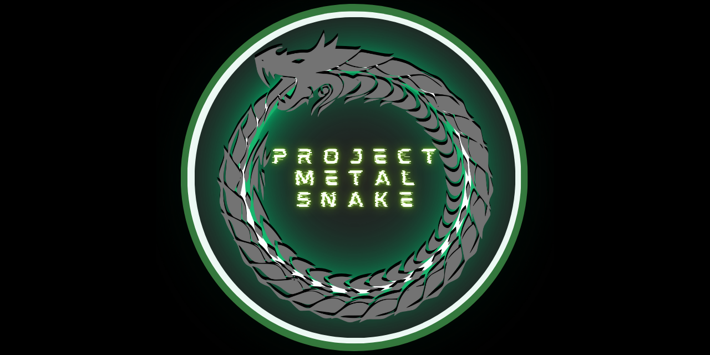

 # Project: METAL SNAKE 
 
   

**Project Sponsor:** [Brendan Gasparin](https://linktr.ee/brendangasparin)  
**Project Manager:** [Brendan Gasparin](https://linktr.ee/brendangasparin)  
**Commencement Date:** 2024-07-29  

---

Project: METAL SNAKE is the creation of an on-premises physical cybersecurity lab with a LAMP stack web server and other services for web development, programming, and training in cybersecurity. It also involves the creation of cloud-based virtual machine instances to host client websites and a System Information and Event Management (SIEM) system.  

This project will be throughly documented in multiple media formats so that it can be replicated.  

Remember to give this repository a star and give Project Manager [Brendan Gasparin](https://github.com/brendangasparin) a follow on Github to keep up with other projects.    

---

Here is the daily project log:
- [Project Log](./project-log/log.md)  

---

## The Waterfall Model of Project Management

Project: METAL SNAKE is using the Waterfall Model for project management. In Phase 3, the execution phase, a more agile method of software development may be used to build the network and configure and program required software.  

The Waterfall Model typically has five or six sequential stages that must be completed in order. These are:  

1. Initiation  
2. Planning and Design  
3. Execution  
4. Testing  
5. Installation / Deployment  
6. Closure and Maintenance  

Each of these phases have their own tasks and deliverables.  

**Phase 1** deliverables will be: 
- [Preliminary Schedule](./docs/phase-1.0/METAL-SNAKE-Preliminary-Schedule.pdf)
- Business Case  
- [Stakeholder Register](./docs/phase-1.0/METAL-SNAKE-Stakeholder-Register.pdf)  
- Project Charter  
- [Project Manager Assignment](./docs/phase-1.0/METAL-SNAKE-Project-Manager-Assignment.pdf)  
- [Scope Statement](./docs/phase-1.0/METAL-SNAKE-Scope-Statement.pdf)  
- [Initial Risk Register](./docs/phase-1.0/METAL-SNAKE-Risk-Register.pdf)  
- High-Level Project Plan  
- Requirements Document  
- Introductory Video  

As Project: METAL SNAKE is being executed publicly, these deliverables will be released (with contact details redacted) using this Github repository and YouTube.  