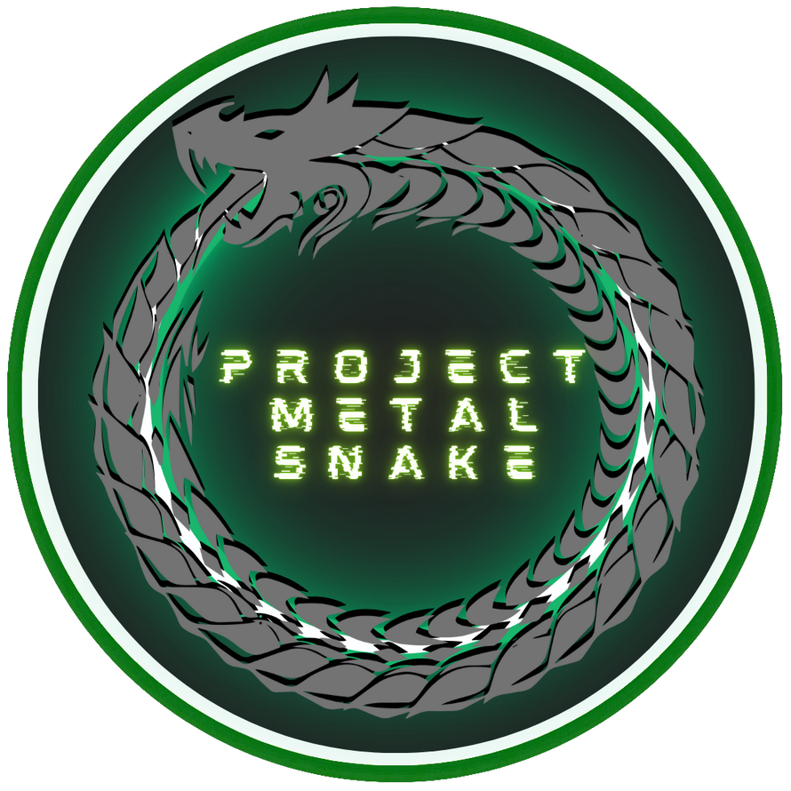

# Project-METAL-SNAKE  

**Project Sponsor:** [Brendan Gasparin](https://linktr.ee/brendangasparin)  
**Project Manager:** [Brendan Gasparin](https://linktr.ee/brendangasparin)  
**Commencement Date:** 2024-07-29  

---

Project: METAL SNAKE is the creation of an on-premises physical cybersecurity lab with a LAMP stack web server and other services for web development, programming, and training in cybersecurity.  

I plan to thoroughly document this project in multiple media formats so remember to give this repository a star and give [me](https://github.com/brendangasparin) a follow on Github.  

I am using the Waterfall Model of Project Management in order to manage the project. Currently I am in Phase 1, the initiation phase. When I get to Phase 3, the execution phase, I might use a more agile method of project management to build the network and configure and program required software.  

---

Here is my daily project log:
- [Project Log](./project-log/log.md)  