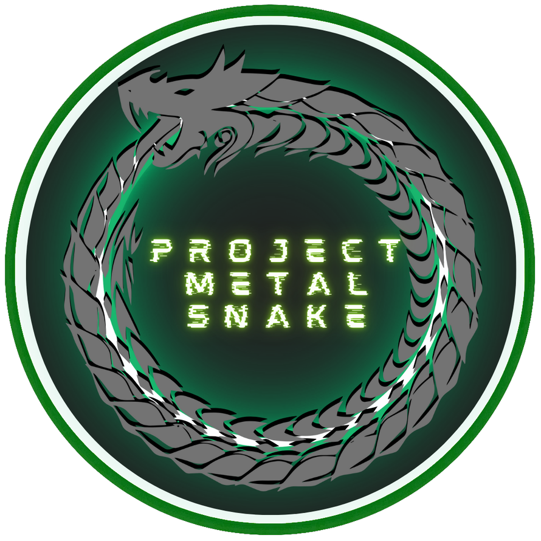

# Project: METAL SNAKE Development Blog  

---

This is the development blog for Project: METAL SNAKE.  

---

## 2024-07-29  

**Phase 1:** Initiation  

The project's initiation phase begins today. I have constructed this Github repository and log to keep track of project progress, documentation, and any code files I want to share publicly.  

Locally, I am using the [Obsidian](https://obsidian.md) note-taking app to keep track of any necessary knowledge and planning for the project. This will make it easy to transfer any content I want to Github.  

In order to complete the Initiation phase I should produce the following deliverables this week:

- Business case
- Stakeholder register
- Project charter
- Project manager assignment
- Scope statement
- Initial risk register
- High-level project plan
- Requirements document
- Introductory video

### Currently Working On:  

- Initiation phase document templates (for later re-use in other projects)  
- Business case  
- Stakeholder register  
- Github repository and this blog  

### Deliverables Completed:  

None

---

[Back to Project: METAL SNAKE](../README.md)  