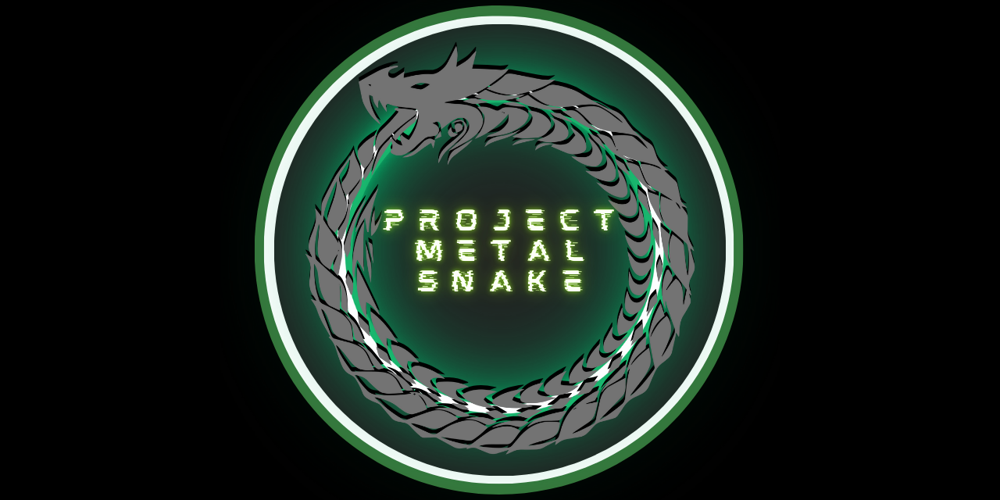

# Project: METAL SNAKE Development Blog  

  

---  

This is the development blog for Project: METAL SNAKE.  

---

## 2024-08-09  

**Phase 1:** Initiation  

### Currently Working On:  

- Business Case   

### Deliverables Completed:  

None  

## 2024-08-08  

**Phase 1:** Initiation  

Updated [Preliminary Schedule](../docs/phase-1.0/METAL-SNAKE-Preliminary-Schedule.pdf) to account for the fact that the document deliverables are taking more time than anticipated. Added one week to initiation and planning phases to account for project documentation, and one week to closure phase to allow for sufficient software documentation.  

Updated the [Preliminary Schedule](../docs/phase-1.0/METAL-SNAKE-Preliminary-Schedule.pdf).  

Still working on the Business Case. Today I worked on the Benefits Realization section.  

Started Logan's training in HTML.  

### Currently Working On:  

- Business Case, [Preliminary Schedule](../docs/phase-1.0/METAL-SNAKE-Preliminary-Schedule.pdf)   

### Deliverables Completed:  

[Preliminary Schedule](../docs/phase-1.0/METAL-SNAKE-Preliminary-Schedule.pdf)  

## 2024-08-07  

**Phase 1:** Initiation  

Got very little work done. Thinking of changing the project schedule to incorporate two weeks for initiation, planning, and closure phases to allow for concentration and completion of documentation.  

### Currently Working On:  

- Business Case  

### Deliverables Completed:  

None  

## 2024-08-06  

**Phase 1:** Initiation  

I did not complete any deliverables today but I did enlist an intern for help with the organization.  

### Currently Working On:  

- Business Case, Initiation Phase Templates  

### Deliverables Completed:  

None  

## 2024-08-05  

**Phase 2:** Planning & Design (and unfinished Initiation documentation)  

Completed a preliminary [risk register](../docs/phase-1.0/METAL-SNAKE-Risk-Register.pdf) and the [project charter](../docs/phase-1.0/METAL-SNAKE-Project-Charter.pdf). Catching up on my schedule.  

### Currently Working On:  

- Business case, [Risk Register](../docs/phase-1.0/METAL-SNAKE-Risk-Register.pdf)  

### Deliverables Completed:  

- [Project Charter](../docs/phase-1.0/METAL-SNAKE-Project-Charter.pdf)
- [Risk Register](../docs/phase-1.0/METAL-SNAKE-Risk-Register.pdf)  

## 2024-08-04  

**Phase 1:** Initiation  

Today I completed the scope statement, and a template for the risk register.  

This is the last day of the initiation phase and I am already behind schedule, as I haven't finished the business case or even started the project charter. I will work my buns off in the next 24 hours to try and catch up.  

I have noticed I am using Obsidian less and less to record document template information and instead opting to simply create the templates in Microsoft Word and Excel. If I were to take notes in Obsidian and create the templates simultaneously it would take me twice as long and I am too strapped for time. I can copy and paste the template information into Obsidian later.  

### Currently Working On:  

- Business case, [Scope Statement](../docs/phase-1.0/METAL-SNAKE-Scope-Statement.pdf), Risk Register  

### Deliverables Completed:  

- [Scope Statement](../docs/phase-1.0/METAL-SNAKE-Scope-Statement.pdf)

## 2024-08-03  

**Phase 1:** Initiation  

Today I worked on the business case and completed the [Project Manager Assignment](../docs/phase-1.0/METAL-SNAKE-Project-Manager-Assignment.pdf) document. There is only one more day in this phase and I have so much to do.  

### Currently Working On:  

- Business case  
- [Project Manager Assignment](../docs/phase-1.0/METAL-SNAKE-Project-Manager-Assignment.pdf)  

### Deliverables Completed:  

- [Project Manager Assignment](../docs/phase-1.0/METAL-SNAKE-Project-Manager-Assignment.pdf)  

## 2024-08-02  

**Phase 1:** Initiation  

Today I worked on the business case. I realized I had done the financial projections wrong and had to restart them. The business case is taking forever.  

### Currently Working On:  

- Business case  

### Deliverables Completed:  

None

## 2024-08-01  

**Phase 1:** Initiation  

Today I worked on the business case. The financial projection section is taking a lot of time to complete.  

### Currently Working On:  

- Business case  

### Deliverables Completed:  

None

## 2024-07-31  

**Phase 1:** Initiation  

Today I completed the preliminary schedule and the stakeholder register. I also updated the logo and worked on the business case.  

### Currently Working On:  

- Initiation phase document templates (for later re-use in other projects)  
- Business case  

### Deliverables Completed:  

- [Preliminary Schedule](../docs/phase-1.0/METAL-SNAKE-Preliminary-Schedule.pdf)  
- [Stakeholder Register](../docs/phase-1.0/METAL-SNAKE-Stakeholder-Register.pdf)    

## 2024-07-30  

**Phase 1:** Initiation  

Today I worked on the project initiation templates, focusing on the project manager assignment and initial risk register.  

I also worked on the business case. It is about 50% complete.

### Currently Working On:  

- Initiation phase document templates (for later re-use in other projects)  
- Business case  

### Deliverables Completed:  

None

## 2024-07-29  

**Phase 1:** Initiation  

The project's initiation phase begins today. This Github repository has been created to keep track of project progress, documentation, and code files.  

Locally, I am using the [Obsidian](https://obsidian.md) note-taking app to keep track of any necessary knowledge and planning for the project. This will make it easy to transfer any content I want to Github.  

In order to complete the Initiation phase I should produce the following deliverables this week:  

- Business case
- Stakeholder register
- Project charter
- Project manager assignment
- Scope statement
- Initial risk register
- Introductory video

The following initiation phase deliverables are also desirable, but were not completed due to time constraints, and because they can be completed in phase 2:  

- High-level project plan
- Requirements document

### Currently Working On:  

- Initiation phase document templates (for later re-use in other projects)  
- Business case  
- Stakeholder register (needs project completion date and project duration)  
- Github repository and this blog  

### Deliverables Completed:  

None

---

[Back to Project: METAL SNAKE](../README.md)  